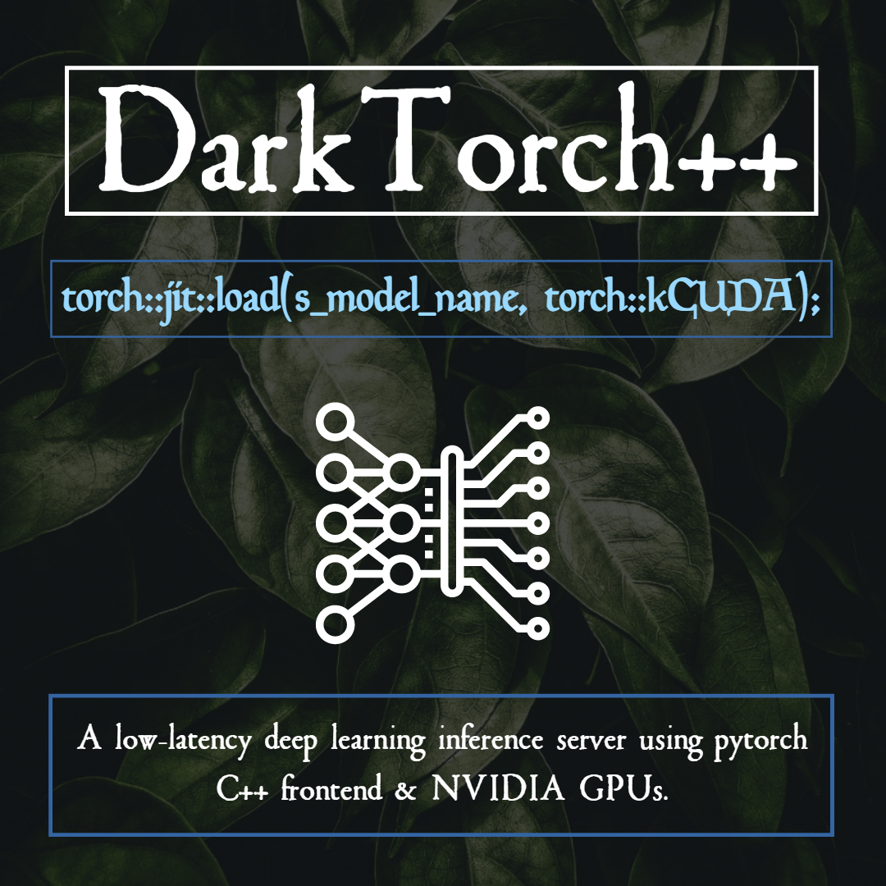

# DarkTorch

## Introduction



This repository implements a low-latency deep learning inference server using pytorch C++ frontend & NVIDIA GPUs. 

This projects makes use of several technologies:
- [Docker](https://www.docker.com/): for bundling all the dependencies of our program and for easier deployment.
- [Libtorch](https://github.com/BVLC/caffe): because it has good performance and a simple C++ API.

Torch has now two versions:
Download here (Pre-cxx11 ABI): 
https://download.pytorch.org/libtorch/cu100/libtorch-shared-with-deps-1.2.0.zip

Download here (cxx11 ABI, compiled with _GLIBCXX_USE_CXX11_ABI = 1): 
https://download.pytorch.org/libtorch/cu100/libtorch-cxx11-abi-shared-with-deps-1.2.0.zip

- [TensorRT](https://developer.nvidia.com/tensorrt): NVIDIA's high-performance inference engine.
- [OpenCV](http://opencv.org/): to have a simple C++ API for GPU image processing.

# Building

## Prerequisites
- A Kepler or Maxwell NVIDIA GPU with at least 2 GB of memory.
- A Linux system with recent NVIDIA drivers (recommended: 415).
- Install the latest version of [Docker](https://docs.docker.com/linux/step_one/).
- Install [nvidia-docker2](https://github.com/NVIDIA/nvidia-docker/wiki/Installation-(version-2.0)).

## Build command
The command might take a while to execute:
```
```
To speedup the build you can modify [this line](https://github.com/NVIDIA/gpu-rest-engine/blob/master/Dockerfile.caffe_server#L5) to only build for the GPU architecture that you need.


# Testing

## Starting the server
Execute the following command and wait a few seconds for the initialization of the classifiers:
```
```

## Single image Classifiation

```
```

## Benchmarking performance
We can benchmark the performance of our classification server using any tool that can generate HTTP load. We included a Dockerfile
for a benchmarking client using [rakyll/hey](https://github.com/rakyll/hey):
```
```


## Contributing

Feel free to report issues during build or execution. We also welcome suggestions to improve the performance of this application.
