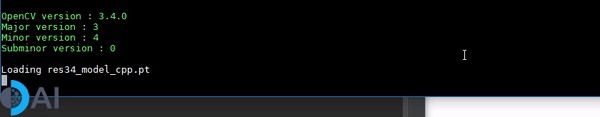
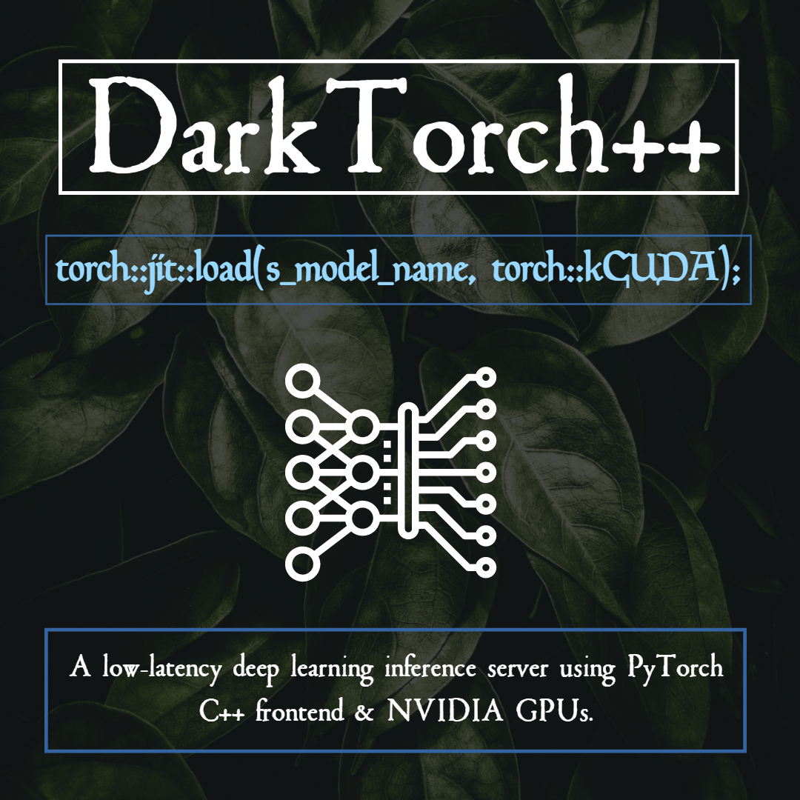

# DarkTorch (Work In Progress)
A low-latency deep learning inference server using pytorch C++ frontend. DarkTorch is written in C++11. 

(A demo of running inference on a PyTorch Resnet34 CNN model using a tqdm like callback)


# Introduction


This repository implements a low-latency deep learning inference server using pytorch C++ frontend & NVIDIA GPUs. 
The DarkTorch service is a C++ application running a HTTP server with a REST API. This service is able to run inference on multiple deep learning models in parallel on all the available GPU processors to obtain the results in the shortest time possible. 

**Table of contents**

  * [Technologies](#Technologies)  
  * [Building](#Building)  
  * [Testing](#Testing)     
  * [Contributors](#contributors)


`torch::jit::script::Module module = torch::jit::load(s_model_name, torch::kCUDA);`


## Technologies
This projects makes use of several technologies:
- [Docker](https://www.docker.com/): for bundling all the dependencies of our program and for easier deployment. 
We inherit from:
```
FROM nvcr.io/nvidia/pytorch:19.02-py3
RUN apt-get update &&\
    apt-get install -y sudo git bash
ENV PATH /usr/local/nvidia/bin:/usr/local/cuda/bin:/code/cmake-3.14.3-Linux-x86_64/bin:${PATH}
ENV PYTHONPATH=/opt/conda/lib/python3.6/site-packages/:$PYTHONPATH
ENV LD_LIBRARY_PATH=${LD_LIBRARY_PATH}:/opt/conda/lib/:/opt/conda/lib/python3.6
...
...
```
The whole docker file is availabe here:
- [Libtorch](https://pytorch.org/): because it has good performance and a simple C++ API. Torch has now two versions:
(Pre-cxx11 ABI): 
https://download.pytorch.org/libtorch/cu100/libtorch-shared-with-deps-1.2.0.zip

(cxx11 ABI, compiled with _GLIBCXX_USE_CXX11_ABI = 1): 
https://download.pytorch.org/libtorch/cu100/libtorch-cxx11-abi-shared-with-deps-1.2.0.zip

- [OpenCV](http://opencv.org/): to have a simple C++ API for GPU image processing.
- [CMake] (https://cmake.org/): refer to the sample C++ applications. Sample `CMakeLists.txt` file is available here:
```cpp
cmake_minimum_required(VERSION 3.5 FATAL_ERROR)

project(FeatureEx VERSION 1.2.3.4 LANGUAGES CXX)
set(PROJECT_NAME FeatureEx)

if (NOT DEFINED CMAKE_CXX_STANDARD)
    SET(CMAKE_CXX_STANDARD 11)
    SET(CMAKE_CXX_STANDARD_REQUIRED ON)
    set(CMAKE_VERBOSE_MAKEFILE ON)
endif ()
if (CMAKE_CXX_STANDARD LESS 11)
    message(FATAL_ERROR "CMAKE_CXX_STANDARD is less than 11.")
endif ()

set(CMAKE_BUILD_TYPE Release)
set(CXX_RELEASE_FLAGS = -O3 -march=native)

```

# Building

## Prerequisites
- A Kepler or Maxwell NVIDIA GPU with at least 2 GB of memory.
- A Linux system with recent NVIDIA drivers (recommended: 415).
- Install the latest version of [Docker](https://docs.docker.com/linux/step_one/).
- Install [nvidia-docker2](https://github.com/NVIDIA/nvidia-docker/wiki/Installation-(version-2.0)).

## Build command
The command might take a while to execute:
```bash
sudo docker build -t  cuda10-trt cuda10-trt
```

# Testing

## Start the docker container
```bash
sudo nvidia-docker run -it --shm-size=4g --env="DISPLAY" --volume="$HOME/.Xauthority:/root/.Xauthority:rw" -v /tmp/.X11-unix:/tmp/.X11-unix:rw -p 8097:8097  -p 3122:22 -p 7842:7842 -p 8787:8787 -p 8786:8786 -p 8788:8788 -p 8888:8888 -p 5000:5000 -v ~/dev/:/root/sharedfolder -v ~/dev/.torch/models/:/root/.cache/torch/checkpoints/ cuda10-trt  bash
```
We assume that the PyTorch models are mapped externally to docker via the `-v` command and reside here: `~/dev/.torch/models/`. You can ammend that to reflect teh settings in your environment. 

## Starting the server
Execute the following command and wait a few seconds for the initialization of the classifiers:
```
```

## Single image Classifiation

```
```

## Tested CNN models

- ResNet9
- ResNet18
- ResNet50
- ResNet101

## Performance:

<table><tbody>
    <th valign="bottom">Architecture</th>
    <th valign="bottom">Threads</th>
    <th valign="bottom">Batch Size</th>    
    <th valign="bottom">Inference Speed(fps)</th>
    <tr>
        <td rowspan="2">ResNet9 https://github.com/lambdal/cifar10-fast</td>
        <td>1</td><td>1</td><td>400</td>        
    </tr>
    <tr>
        <td rowspan="2">BaiduNet8 https://github.com/BAIDU-USA-GAIT-LEOPARD/CIFAR10-Inference-BaiduNet8</td>
        <td>1</td><td>1</td><td>600</td>        
    </tr>        
</tbody></table>

The inference speed is benchmarked on a single NVIDIA Pascal Titan Xp GPU, without visualization.

## Environment
The code is developed under the following configurations.
- Hardware: 1 GPU for testing 
- Software: Ubuntu 16.04.3 LTS, ***CUDA>=10.0, Python>=3.6, PyTorch>=1.2.0***
- Dependencies: refer to the docker file


## Benchmarking performance
We can benchmark the performance of our inference server using any tool that can generate HTTP load. We included a Dockerfile
for a benchmarking client using [rakyll/hey](https://github.com/rakyll/hey):
```
```

## Contributing

Feel free to report issues during build or execution. We also welcome suggestions to improve the performance of this application.

## Author
Shlomo Kashani, Head of AI at DeepOncology AI, 
Kaggle Expert, Founder of Tel-Aviv Deep Learning Bootcamp: shlomo@deeponcology.ai

## Citation

If you find the code or trained models useful, please consider citing:

```
@misc{DarkTorch2019,
  author={Kashani, Shlomo},
  title={DarkTorch2019},
  howpublished={\url{https://github.com/QuantScientist/DarkTorch/}},
  year={2019}
}
```

